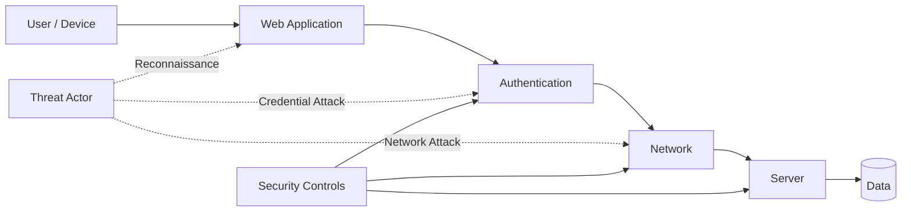

<p align="center">
  
</p>

<p align="center">
  
</p>

<h2 align="center">Sumiaya Afrin</h2>

<p align="center">
  <strong>Computer Science & Engineering Student</strong>
</p>

<p align="center">
  Cybersecurity &nbsp;•&nbsp; Network Security &nbsp;•&nbsp; Python &nbsp;•&nbsp; Ethical Hacking
</p>

<p align="center">
  
</p>

<p align="center">

<a href="https://www.linkedin.com/in/sumiayaafrin/">
  
</a>

<a href="mailto:srabonis181@gmail.com">
  
</a>

<a href="https://github.com/srabonis181-hue">
  
</a>

</p>

---

## 🛡️ Cybersecurity Profile

I am a **Computer Science & Engineering student** developing a strong foundation in **Cybersecurity, Network Security, Python, and Secure Software Development**.

What draws me to cybersecurity is not simply the tools.

It is understanding how a normal request moves through a system, where trust is created, how that trust can be abused, and what defenders can observe when something goes wrong.

I am currently building that understanding through **networking concepts, security fundamentals, programming, practical projects, and continuous hands-on learning**.

> **I want to understand both sides of security — how systems are attacked and how they can be defended.**

---

## ⚡ Security Focus

<p align="center">


</p>

### Network Security

`TCP/IP` `DNS` `HTTP/HTTPS` `Network Protocols` `Traffic Analysis` `Network Defense`

### Security Fundamentals

`Authentication` `Access Control` `Vulnerability Analysis` `Threat Awareness` `Security Principles`

### Web & Application Security

`Request/Response Flow` `Authentication Security` `Input Validation` `Secure Coding` `Web Vulnerabilities`

### Python

`Automation` `Problem Solving` `OOP` `Security Scripting` `Application Development`

---

## 🌐 Understanding the Attack Surface



<p align="center">
  <strong>Every connection creates communication. Every communication creates an attack surface.</strong>
</p>

---

## 🔍 Attacker Mindset × Defender Mindset

### Red-side thinking

* What information is exposed?
* Where does the system trust user input?
* Can authentication be weakened?
* What services are reachable?
* Where could misconfiguration create risk?

### Blue-side thinking

* What should normal behavior look like?
* What traffic should be monitored?
* How can suspicious activity be detected?
* How can access be restricted?
* How can the attack surface be reduced?

> **Learning to think from both perspectives helps build a stronger security mindset.**

---

## 🧰 Security & Development Environment

<p align="center">
  
</p>

<p align="center">


</p>

<p align="center">
  <sub>Exploring these technologies as part of my cybersecurity learning journey.</sub>
</p>

---

## 🧪 Featured Security Project

### 🔐 Secure WiFi Authentication — DFA

**Security Area:** Authentication & Access Control
**Technology:** `Python` `Tkinter` `DFA`

A desktop application that demonstrates a WiFi authentication workflow using **Deterministic Finite Automata**.

The project explores how authentication logic can be modeled through defined states and transitions while connecting theoretical computer science with security-focused software development.

**Key Concepts**

`Authentication Flow` • `State Validation` • `Access Logic` • `Python GUI`

🔗 [View Project](https://github.com/srabonis181-hue/secure-wifi-authentication-dfa)

---

## 💻 Other Development Work

### Smart Grocery Store Web App

A practical application focused on software logic, interface development, and structured application workflows.

**Focus:** `Web Development` • `Application Logic` • `Software Design`

🔗 [View Repository](https://github.com/srabonis181-hue/Smart-Grocery-Store-Web-App)

### FlightBooker

A booking application developed around real-world user interaction and application workflow design.

**Focus:** `Web Application` • `User Flow` • `Problem Solving`

🔗 [View Repository](https://github.com/srabonis181-hue/FlightBooker)

---

## 📡 Current Security Path

```text
NETWORK FUNDAMENTALS
        │
        ▼
PROTOCOL UNDERSTANDING
        │
        ▼
TRAFFIC ANALYSIS
        │
        ▼
SECURITY FUNDAMENTALS
        │
        ▼
VULNERABILITY ANALYSIS
        │
        ▼
ETHICAL HACKING
        │
        ▼
DEFENSIVE SECURITY
```

Currently strengthening:

**Network Security**
→ TCP/IP, protocols, DNS, HTTP/HTTPS

**Cybersecurity**
→ vulnerabilities, authentication, access control

**Security Testing**
→ reconnaissance, traffic analysis, web security concepts

**Python**
→ programming, automation, security-oriented scripting

---

## 🧠 Security Philosophy

One thing cybersecurity continues to teach me is that:

> **A vulnerability rarely makes sense without understanding the system around it.**

So before asking:

**“How can this be hacked?”**

I prefer to first understand:

**How does it work?**
**What does it communicate with?**
**What does it trust?**
**What should normal behavior look like?**
**Where can that trust fail?**

That is the security mindset I am working to develop.

---

## 🎯 Direction

My goal is to continue developing practical knowledge across:

<p align="center">


</p>

with a long-term interest in becoming stronger at **security analysis, network defense, vulnerability assessment, and secure systems**.

---

## 🤝 Connect

<p align="center">

<a href="https://www.linkedin.com/in/sumiayaafrin/">
  
</a>

<a href="mailto:srabonis181@gmail.com">
  
</a>

<a href="https://github.com/srabonis181-hue">
  
</a>

</p>

<p align="center">
  Open to connecting with cybersecurity learners, developers,
  researchers, and security professionals.
</p>

---

<h3 align="center">
  <code>Think Like an Attacker • Build Like an Engineer • Defend Like an Analyst</code>
</h3>

<p align="center">
  
</p>
